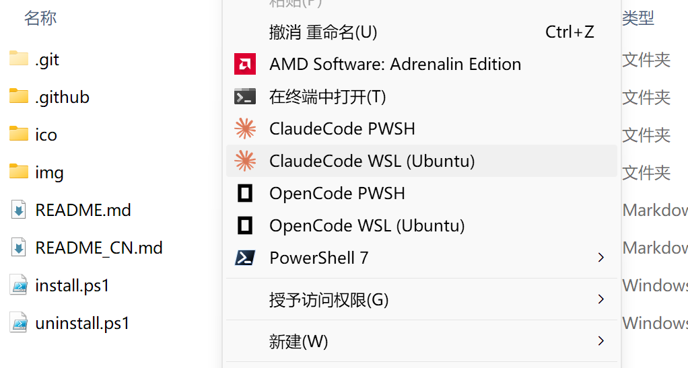

# Coding Launcher —— AI 编程 CLI 工具右键菜单启动器

<center>

[🇨🇳 简体中文](README_CN.md) | [🇬🇧 English](README.md)

</center>


在 Windows 右键菜单中添加 "ClaudeCode PWSH"、"CodexCli PWSH"、"CopilotCli PWSH"、"GeminiCli PWSH" 和 "OpenCode PWSH" 选项，从任意文件夹直接启动工具——无需打开终端、无需 `cd`、无需手动输入命令。

支持从 **Windows** 或 **WSL**（Windows Subsystem for Linux）环境中启动工具。

<center>



</center>

## 脚本目标

省去以下重复操作：
1. 打开终端
2. `cd` 进入项目目录
3. 手动输入 `claude`、`codex`、`copilot-cli`、`gemini` 或 `opencode` 命令

改为：**右键点击任意文件夹（或文件夹内空白处）→ 选择对应工具 → 完成。**

## 支持的工具

| 工具 | 安装命令 |
|---|---|
| **ClaudeCode** | `npm i -g @anthropic-ai/claude-code` |
| **Codex CLI** | `npm i -g @openai/codex` |
| **GitHub Copilot CLI** | `npm i -g github-copilot-cli` |
| **Gemini CLI** | `npm i -g @anthropic/gemini-cli` |
| **OpenCode** | `winget install SST.opencode` |

所有工具均支持 **Windows** 和 **WSL** 环境。

## 环境要求

- Windows 10/11
- 已安装 PowerShell 7（`pwsh.exe`）
- WSL（可选）—— 用于在 Linux 环境中打开工具

## 安装方法

1. 将以下所有文件下载到同一个本地文件夹：
   - `install.ps1`
   - `uninstall.ps1`
   - `ico/` 文件夹（所有图标文件）

   **或直接下载压缩包解压：[Releases](https://github.com/y-cyfor/Coding-Launcher/releases)**

2. 右键点击 `install.ps1` → **"使用 PowerShell 运行"**

3. 根据提示选择全局图标样式：
   - `[1]` 黑白（默认）
   - `[2]` 彩色

4. 脚本会扫描本地已安装的工具（Windows + WSL），并显示检测结果：
   ```
   Windows 已安装: ClaudeCode、OpenCode
   Windows 未安装: CodexCli、CopilotCli、GeminiCli

   检测到 WSL 发行版: Ubuntu
     Ubuntu 已安装: ClaudeCode、CodexCli
     Ubuntu 未安装: CopilotCli、GeminiCli、OpenCode
   ```

5. 弹出选择菜单，选择需要添加的项：
   ```
   ══════════════════════════════════════════════════════
     可用菜单项 / Available menu items:
   ══════════════════════════════════════════════════════
     [1] ClaudeCode        (Windows)
     [2] OpenCode          (Windows)
     [3] ClaudeCode WSL    (Ubuntu)
     [4] CodexCli WSL      (Ubuntu)
   ══════════════════════════════════════════════════════
   ```

   输入编号如 `1,3,5` 或范围如 `1-3`，输入 `all` 全选（默认）。

6. 如果弹出 UAC 权限提示，点击 **"是"** 授予管理员权限。

## 安装内容

- 图标文件复制到 `%USERPROFILE%\.context-menu-icons\`（持久化存储）
- 注册表项写入 `HKCU\Software\Classes\Directory\Background\shell\` 和 `HKCU\Software\Classes\Directory\shell\`

**文件夹空白处右键**和**文件夹图标上右键**都会显示对应的菜单项。

WSL 菜单项会通过 `wslpath` 自动将 Windows 路径转换为 WSL 路径。

## 卸载方法

右键点击 `uninstall.ps1` → **"使用 PowerShell 运行"** → 确认 UAC 提示。这将移除所有注册表项（包括 WSL 变体）和图标目录。

## 注意事项

- 如果菜单项没有立即出现，请重启资源管理器或注销后重新登录。
- 随时可以重新运行 `install.ps1` 切换黑白/彩色图标，或为后续新安装的工具注册菜单。
- 安装期间 `ico/` 文件夹必须与脚本放在同一目录。安装完成后，原始图标文件夹可以安全删除（图标已复制到持久化位置）。

## 工具

**ClaudeCode**

**小米 MiMo-V2.5-Pro**
